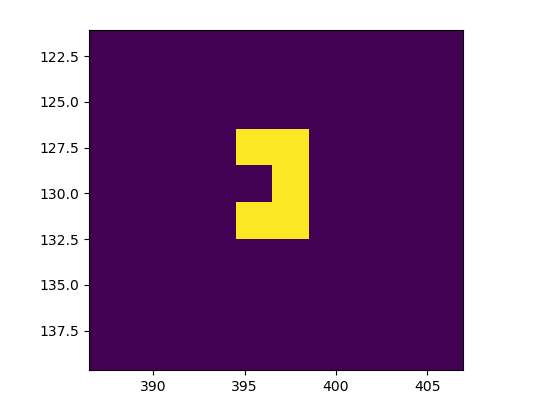
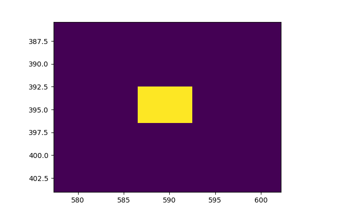

## Подсчет колличества обьекта в файле

### Объекты в файле представляют собой 2 вида прямоугольников
<p>
1 вид



<p>
2 вид



<p>
Общее колличество объектов равно : 500

<p>
Я решил пойти по следующему пути:
<li> 1) Найти общее колличество обьектов на изображении
<li> 2) Отфильтровать один вид обьектов (в данном случае 2 вид) и получить колличество обьектов другого вида (в данном случае 1 вид)

<p>
Маска для фильтрования:

```Python
    np.array([[1,1,1],[0,1,0],[1,1,1]])
```

```
    111
    010
    111
```

### Вывод
```
number of figures on image: 500
number of rectangles on image: 92
number of other objects on image: 408

```
